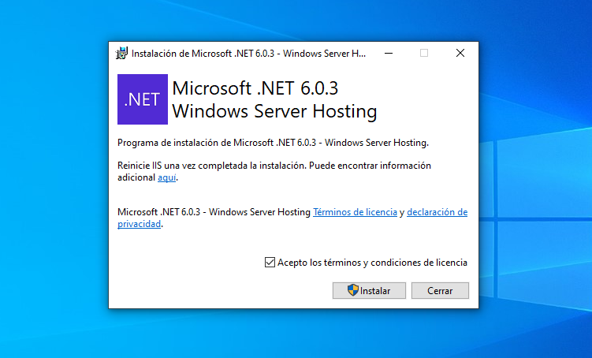
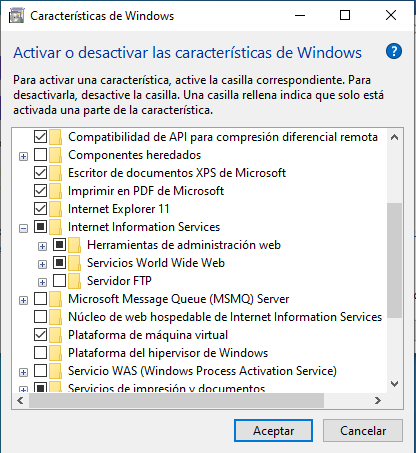
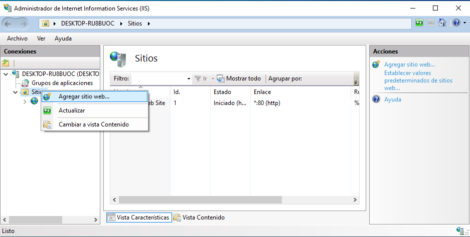
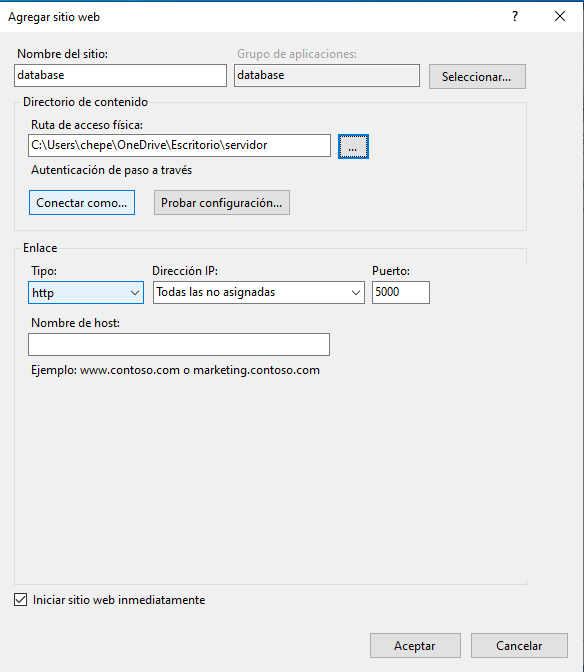
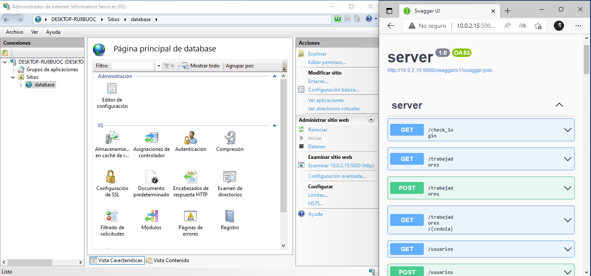
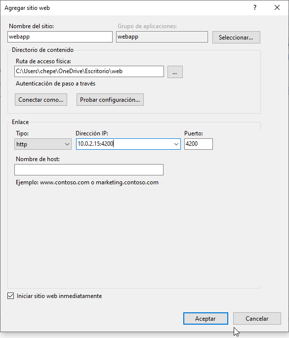

---
title:
  Instituto Tecnológico de Costa Rica\endgraf\bigskip \endgraf\bigskip\bigskip\
  Manual de Instalación Sistema Tabas \endgraf\bigskip\bigskip\bigskip\bigskip
author:
  - José Morales Vargas, carné 2019024270
  - Alejandro Soto Chacón, carné 2019008164
  - Ignacio Vargas Campos, carné 2019053776
  - José Retana Corrales, carné 2020144743
date: \bigskip\bigskip\bigskip\bigskip Área Académica de\endgraf Ingeniería en Computadores \endgraf\bigskip\bigskip\ Bases de Datos \endgraf  (CE3101) \endgraf\bigskip\bigskip Profesor Marco Rivera Meneses \endgraf\vfill  Semestre I 2022
header-includes:
  - \setlength\parindent{24pt}
  - \usepackage{url}
  - \usepackage{float}
  - \floatplacement{figure}{H}
lang: es-ES
papersize: letter
classoption: fleqn
geometry: margin=1in
fontsize: 12pt
fontfamily: sans
linestretch: 1.5
bibliography: bibliografia.bib
csl: /home/josfemova/UsefulRepos/styles/ieee.csl
nocite: |
...

\maketitle
\thispagestyle{empty}
\clearpage
\tableofcontents
\pagenumbering{roman}
\clearpage
\pagenumbering{arabic}
\setcounter{page}{1}

# Servidor 

Requisitos previos:

- Windows 10 Actualizado
- Conexión a internet

Pasos de instalación:

1. En primer lugar debe instalar instalar el SDK de .NET Core para tener acceso a las herramientas de `dotnet`. Los paquetes de instalación se pueden conseguir en el link provisto anteriormente.

2. Instale el `Hosting Bundle` de Runtime de ASP .NET Core  <https://dotnet.microsoft.com/en-us/download/dotnet/6.0> el cual permite correr aplicaciones de .NET Core en IIS.



3. Abra el administrador de programas (comando `appwiz.cpl`)

4. Abra el menú de "Agregar o Desactivar características de Windows"

5. Marque la opción de "Internet Information Services" y haga click en aceptar



6. En el menú de búsqueda de la barra de tareas busque el programa "Administrador de Internet Information Services"



7. Haga click derecho en el menú "Sitios" y escoja la opción de Agregar un nuevo sitio web.

8. La configuración dependerá según sus necesidades, como prueba de concepto, se usará el usuario "Todos" para autenticación. Asegúrese de que el usuario que utilizará para autenticarse tenga acceso a la carpeta en la que se encuentra la aplicación. Utilice la ruta de la carpeta en donde se encuentra la version compilada de la aplicación. De igual manera, utilice la dirección IP adecuada para su uso, al igual que el nombre del sitio web. 



9. Al confirmar la configuración, inmediatamente IIS ejecutará la aplicación. Puede chequear el estatus de la aplicación llengo al enlace:

```
http://su.direccion.ip.o:5000/swagger
```

10. Lo anterior debería abrir una aplicación en la que puede comprobar el funcionamiento de la REST API.



11. Si no logra acceder a la aplicación desde otro computador, necesitará agregar reglas del FireWall para permitir comunicación en el puerto 5000, sine embargo, esta configuración está fuera del scope de esta guía puesto depende de su contexto de uso. Se recomienda seguir la guía en el siguiente link:

<https://www.windowscentral.com/how-open-port-windows-firewall>

# App Web

Para este paso es necesario tener instalado el módulo de URL Rewrite de IIS.

1. Suponiendo que ya tiene IIS configurado y con el servidor corriendo, tan solo cree otro sitio web con el nombre de su preferencia en IIS.

2. Las mismas reglas aplican para este despliegue que para el despliegue de servidor - esto incluye el paso de configuración de las credenciales de acuerdo a sus necesidades. Para el contexto de este manual se utilizará el usuario "Todos".



3. La aplicación debe estar configurada para ser accesible desde el puerto 4200. Asegúrese de haber creado las reglas necesarias en el firewall de Windows para permitir las conexiones desde este puerto.

Si el empaquetado provisto no contiene el web.config necesario para IIS, cree dicho archivo en la carpeta de la aplicación y copie el siguiente contenido:

```XML
<?xml version="1.0" encoding="utf-8"?>
<configuration>
  <location path="." inheritInChildApplications="false">
    <system.webServer>
      <rewrite>
    	<rules>
      	  <rule name="Angular Routes" stopProcessing="true">
            <match url=".*" />
            <conditions logicalGrouping="MatchAll">
              <add input="{REQUEST_FILENAME}" matchType="IsFile" negate="true" />
              <add input="{REQUEST_FILENAME}" matchType="IsDirectory" negate="true" />
            </conditions>
            <action type="Rewrite" url="/index.html" />
      	  </rule>
    	</rules>
     </rewrite>
    </system.webServer>
  </location>
</configuration>
```

# App Móvil

Se provee un archivo .apk que facilita la instalación de la aplicación en un celular android.

1. Ejecute el archivo.

2. Ante la solicitud de permisos de instalación presione en aceptar.

3. La aplicación debería aparecer ahora disponible para ser ejecutada.