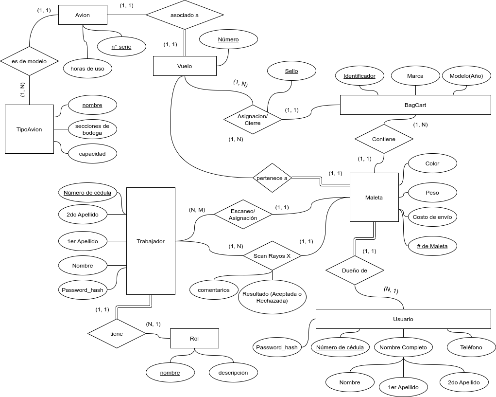
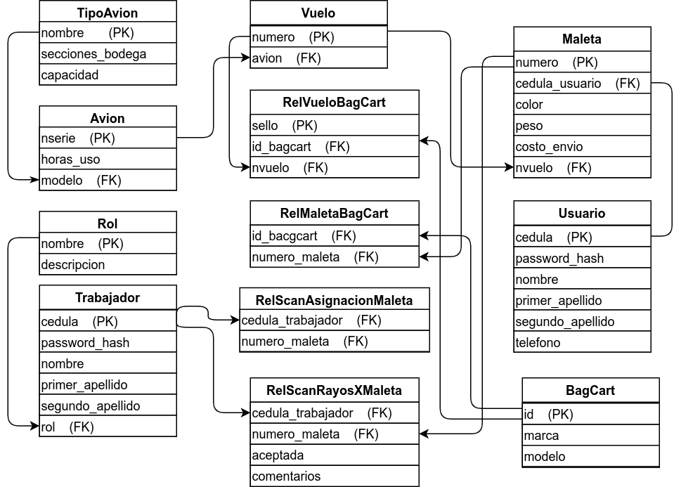
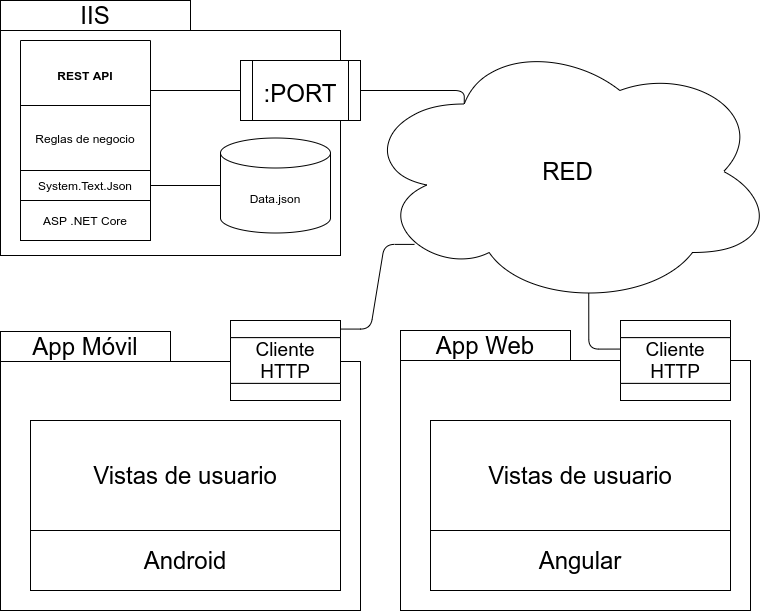
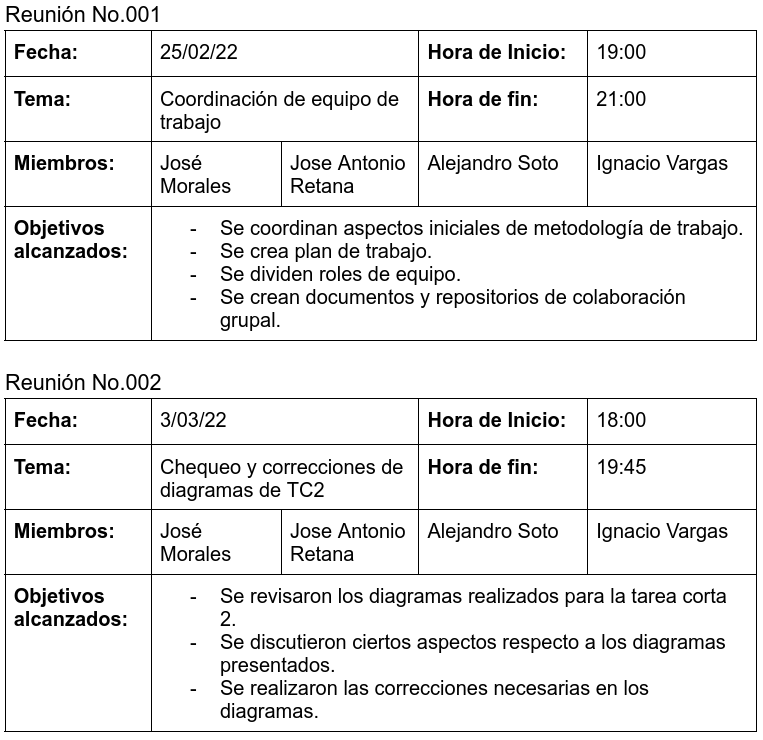
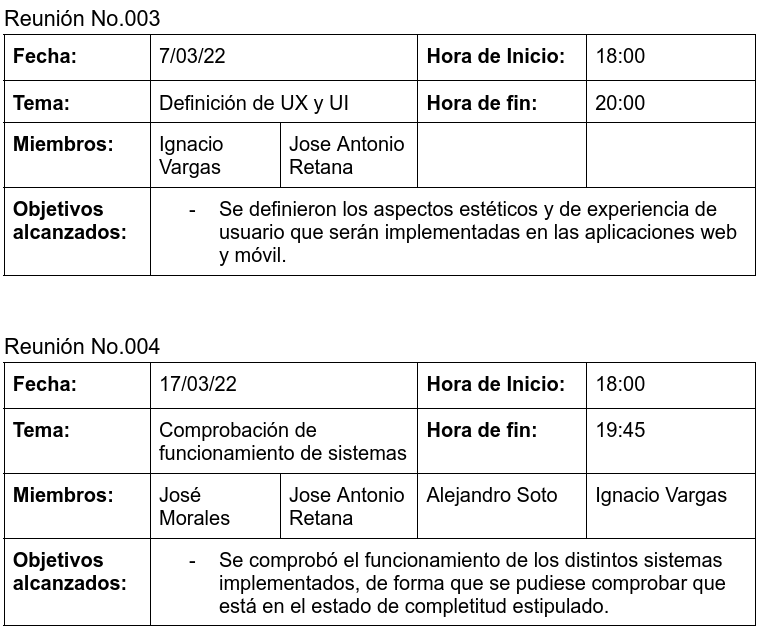
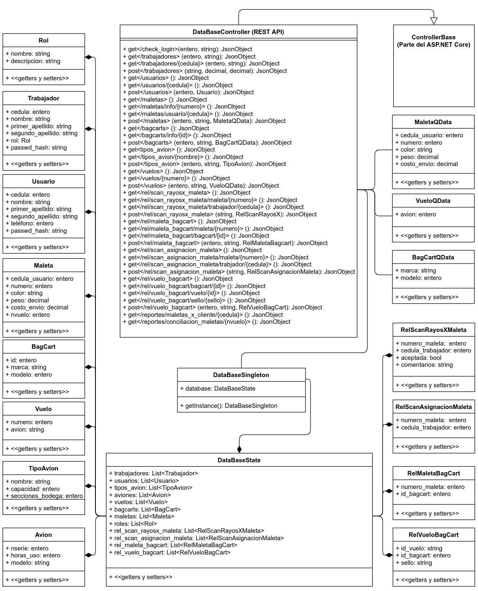
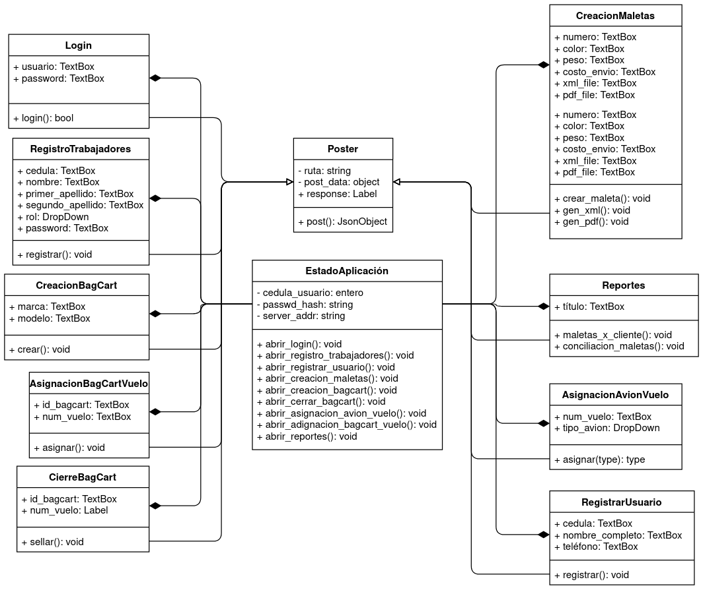
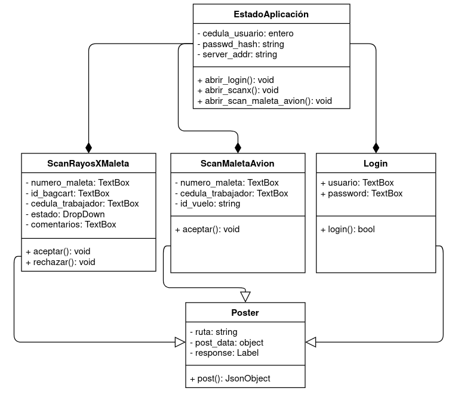

---
title:
  Instituto Tecnológico de Costa Rica\endgraf\bigskip \endgraf\bigskip\bigskip\
  Tarea Corta 1 \endgraf\bigskip\bigskip\bigskip\bigskip
author:
  - José Morales Vargas, carné 2019024270
  - Alejandro Soto Chacón, carné 2019008164
  - Ignacio Vargas Campos, carné 2019053776
  - José Retana Corrales, carné 2020144743
date: \bigskip\bigskip\bigskip\bigskip Área Académica de\endgraf Ingeniería en Computadores \endgraf\bigskip\bigskip\ Bases de Datos \endgraf  (CE3101) \endgraf\bigskip\bigskip Profesor Marco Rivera Meneses \endgraf\vfill  Semestre I 2022
header-includes:
  - \setlength\parindent{24pt}
  - \usepackage{url}
  - \usepackage{float}
  - \floatplacement{figure}{H}
lang: es-ES
papersize: letter
classoption: fleqn
geometry: margin=1in
fontsize: 12pt
fontfamily: sans
linestretch: 1.5
bibliography: bibliografia.bib
csl: /home/josfemova/UsefulRepos/styles/ieee.csl
nocite: | 
  @microsoft-2022A, @microsoft-2022B, @microsoft-2020, @google-2021, @google-2022, @elmasri-2016, @unknown-author-2021
...

\maketitle
\thispagestyle{empty}
\clearpage
\tableofcontents
\pagenumbering{roman}
\clearpage
\pagenumbering{arabic}
\setcounter{page}{1}

## Modelo Conceptual

## Modelo Relacional

 

## Descripción de estructuras de datos 

A continuación se describen las estructuras de datos implementadas
para representar a las diferentes entidades y relaciones.

### **`TipoAvion`**

**Descripción**: Representa a un tipo de avion en específico.

**Atributos**:

- `nombre`: PK. Nombre del tipo de avion.
- `capacidad`: Indica la cantidad de maletas que puede almacenar un tipo de avión.
- `secciones de bodega`: Se refiere a los espacios destinados a las maletas del avión.

### **`Avion`**

**Descripción**: Representa a un avión en específico

**Atributos**:

- `nserie`: PK. Número de serie del avión. Funciona como el identificador de un avión en específico.
- `horas_uso`: Indica las horas de vuelo del avión.
- `modelo`: FK. Indica el tipo de avion que es.

### **`Vuelo`**

**Descripción**: Contiene los datos de un vuelo en particular. 

**Atributos**:

- `numero`: PK. Es el identificador del vuelo el cual se asigna en la creación del mismo.
- `avion`: FK. Referencia al número de serie del avión utilizado para el vuelo.

### **`Rol`**

**Descripción**: Se refiere a un tipo de rol que puede ser adoptado por uno de los trabajadores.

**Atributos**:

- `nombre`: PK. Nombre por el cual se conoce el rol. Este es único.
- `descripción`: Descripción de las funciones del rol.

### **`Trabajador`**

**Descripción**: Representa a uno de los empleados que interactúan con el sistema.

**Atributos**:

- `cedula`: PK. Identificación del trabajador.
- `password_hash`: hash de la contraseña del usuario. Se utiliza para verificar que la autenticación del usuario de sistema sea la correcta.
- `nombre`: Contiene el nombre (sin apellidos) del trabajador.
- `primer_apellido`: Contiene el primer apellido del trabajador.
- `segundo_apellido`: Contiene el segundo apellido del trabajador.
- `rol`: FK. Contiene el nombre del rol del trabajador.

### **`Usuario`**

**Descripción**: Representa a un usuario del servicio de aerolínea.

**Atributos**:

- `cedula`: PK. Identificación del usuario.
- `password_hash`: hash de la contraseña del usuario. Se utiliza para verificar que la autenticación del usuario de sistema sea la correcta.
- `nombre`: Contiene el nombre (sin apellidos) del usuario.
- `primer_apellido`: Contiene el primer apellido del usuario.
- `segundo_apellido`: Contiene el segundo apellido del usuario.
- `telefono`: Número de teléfono para contacto del usuario.

### **`Maleta`**

**Descripción**: Contiene los datos necesarios para representar una maleta.

**Atributos**:

- `numero`: PK. Identifica la maleta. El número se asigna en el registro de la maleta.
- `cedula_usuario`: FK. Referencia al usuario del servicio que es dueño de la maleta.
- `color`: Color de la maleta que se utiliza como hint a la hora de buscar la misma.
- `peso`: Peso en kilos de la maleta
- `costo_envío`: Almacena el costo total de envío de la maleta

### **`BagCart`**

**Descripción**: Contiene la información que referencia a un bagcart, el cual es el medio de transporte utilizado para las maletas desde que las mismas se registran hasta que se abordan al avión.

**Atributos**:

- `id`: PK. Identifica a un bagcart en específico. Se asigna al crear el bagcart.
- `marca`: Indica el vendor del bagcart.
- `modelo`: Indica el tipo de bagcart.

### **`RelScanRayosXMaleta`**

**Descripción**: Representa un registro de escaneo de rayos x de una maleta, el cuál es un requisito previo a abordar la maleta a un bagcart.

**Atributos**:

- `cedula_trabajador`: FK. Referencia al trabajador que realizó el escaneo de la maleta.
- `numero_maleta`: FK. Referencia a la maleta escaneada.
- `aceptada`: Indica si el proceso de escaneado resultó en la maleta siendo aceptada. Si es de valor "falso", significa que la maleta ha sido rechazada. 
- `comentarios`: Observaciones del trabajador respecto al proceso de escaneo.

### **`RelScanAsignacionMaleta`**

**Descripción**: Representa un registro que indica que una maleta ha sido abordada dentro de un avión.

**Atributos**:

- `cedula_trabajador`: FK. Referencia al trabajador que escanea y asigna una maleta a un avión.
- `numero_maleta`: FK. Referencia a la maleta abordada al avión.

### **`RelMaletaBagCart`**

**Descripción**: Representa un registro de asignación de una maleta a un bagcart en específico. 

**Atributos**:

- `numero_maleta`: FK. Referencia a la maleta asignada al bagcart.
- `id_bagcart`: FK. Referencia al bagcart al que ha sido asignada la maleta.

### **`RelVueloBagCart`**

**Descripción**: Registro de la asignación de un bagcart cerrado a un vuelo. A la hora de cerrar un bagcart se le asigna un sello. 

**Atributos**:

- `id_vuelo`: FK. Referencia el número del vuelo al que se ha asignado un bagcart.
- `id_bagcart`: FK. Referencia al bagcart que ha sido asignado a un vuelo.
- `sello`: PK. Valor de sello alfanumérico que se coloca en el bagcart una vez cerrado y asignado.

## Descripción de la arquitectura desarrollada

La arquitectura del sistema consiste de tres aplicaciones que interactúan por medio de una conexión de red.

En el caso del servidor, el mismo consiste de un computador con el sistema operativo Windows 10 corriendo una instancia de IIS en la cual se ejecuta una REST API. En dicho servidor, los datos se almacenan en un archivo "Data.json" el cual es el que administra el REST API. Se puede interactuar con el servidor por medio de una conexión de red direccionada a un puerto en específico - dígase por ejemplo www.misitio.com:5000. 

La aplicación web y la aplicación móvil comparten una arquitectura de aplicación similar, la diferencia es el sistema que usan por debajo. En el caso de la aplicación web, se trata de una aplicación de angular que se ejecuta en el navegador, mientras que para la aplicación móvil el entorno de ejecución es el sistema operativo Android.

## Problemas conocidos

No se identifican.

## Plan de proyecto

### Plan de actividades

El plan de actividades se adjunta como un documento aparte en los anexos.

### Minutas

### Control de versiones

Para la el trabajo en equipo se hizo uso de un repositorio en GitHub el cual se encuentra en el siguiente link:

<https://github.com/itcr3442/CE3101-Tabas>

## Conclusiones y recomendaciones

### Conclusiones

- Se implementó existosamente un servicio de API/REST en el lenguaje de programación C# haciendo uso de las herramientas ofrecidas por .NET Core. 
- Se creó una app móvil para el sistema operativo android en el lenguaje de programación Kotlin.
- Se desarrolló una aplicación web de varias vistas utilizando el framework de Angular.
- Para servicios REST minimalistas, el flujo de trabajo con ASP.NET Core y las herramientas de OpenApi/Swagger facilitan una implementación rápida y eficiente, sin pérdida en desempeño o en mantenibilidad.
- De querer tener un servicio web corriendo en una máquina de Windows y que el mismo sea accesible desde computadoras exteriores, IIS es una herramienta que facilita este proceso. 

### Recomendaciones

- Se recomiendo utilizar el template de "webapi minimal" sobre el template normal, a menos de que exista una justificación de diseño que haga de la webapi usando el esquema de controladores una mejor opción. 
- Si se desea usar Windows como sistema operativo de servidor, se recomeinda utilizar las herramientas de IIS. 
- Para un flujo de desarrollo más similar al estándar de la industria, se recomiendo considerar Linux como plataforma para el hosting de servicios web. 
- Se recomiendo el uso de herramientas de control de versiones pues facilitan fuertemente la colaboración en grupo.

## Diagramas de clases

### Sobre el diseño de la REST API

Como se puede notar, esta aplicación es relativamente simple a nivel de arquitectura. Se aplicó el patrón "Singleton" de manera que solo exista un controlador del archivo de bases de datos, de forma que se puedan evitar condiciones de carrera. La gran parte de las clases son "DataClasses" y se utilizan principalmente para la serialización y deserialización de datos. 

# Bibliografía

::: {#refs}
:::

---

# Anexos
