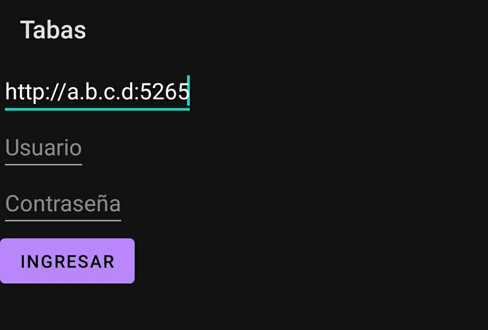
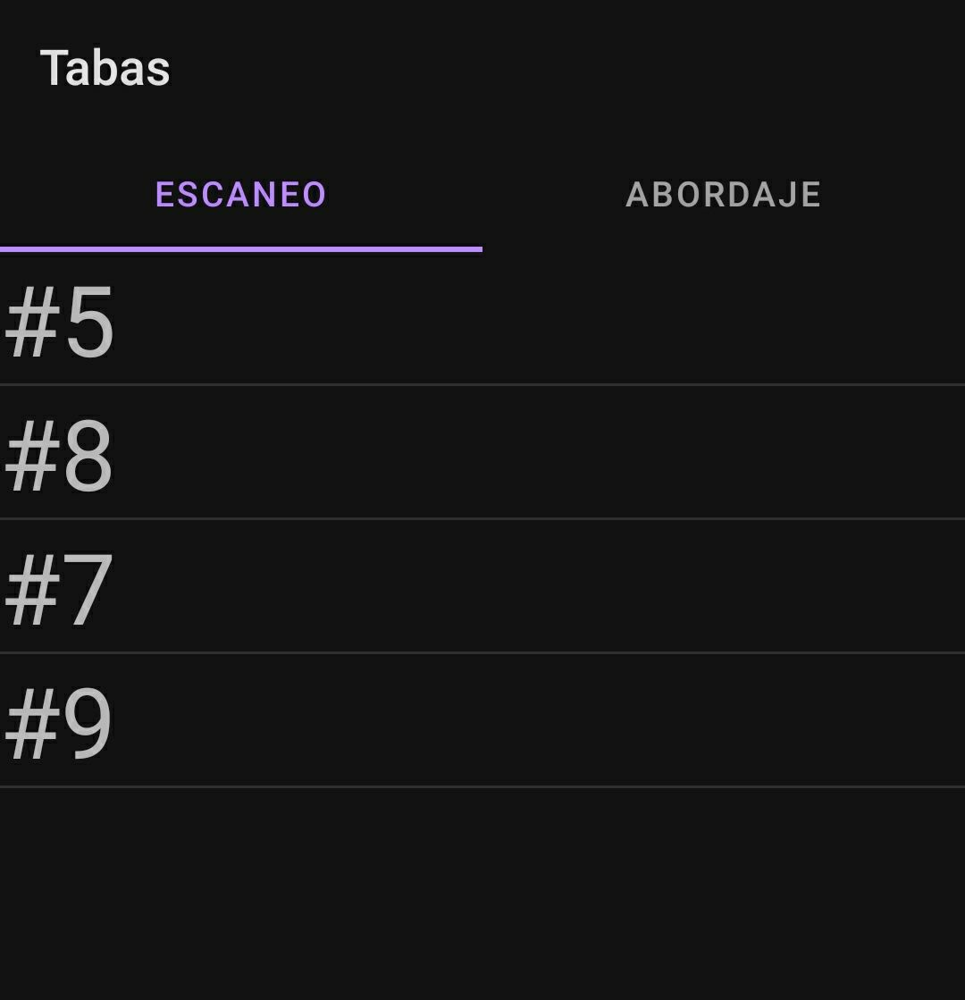
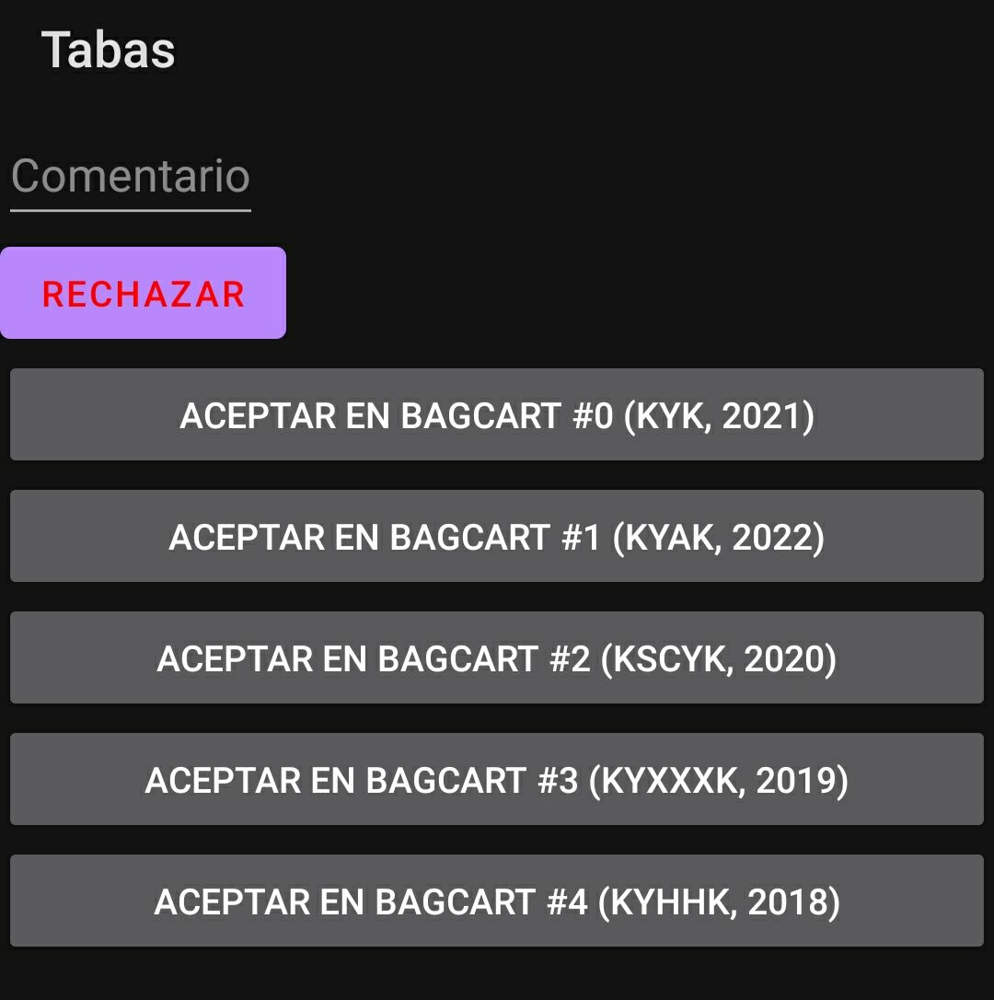

---
title:
  Instituto Tecnológico de Costa Rica\endgraf\bigskip \endgraf\bigskip\bigskip\
  Manual de Usuario Sistema Tabas \endgraf\bigskip\bigskip\bigskip\bigskip
author:
  - José Morales Vargas, carné 2019024270
  - Alejandro Soto Chacón, carné 2019008164
  - Ignacio Vargas Campos, carné 2019053776
  - José Retana Corrales, carné 2020144743
date: \bigskip\bigskip\bigskip\bigskip Área Académica de\endgraf Ingeniería en Computadores \endgraf\bigskip\bigskip\ Bases de Datos \endgraf  (CE3101) \endgraf\bigskip\bigskip Profesor Marco Rivera Meneses \endgraf\vfill  Semestre I 2022
header-includes:
  - \setlength\parindent{24pt}
  - \usepackage{url}
  - \usepackage{float}
  - \floatplacement{figure}{H}
lang: es-ES
papersize: letter
classoption: fleqn
geometry: margin=1in
fontsize: 12pt
fontfamily: sans
linestretch: 1.5
bibliography: bibliografia.bib
csl: /home/josfemova/UsefulRepos/styles/ieee.csl
nocite: |
...

\maketitle
\thispagestyle{empty}
\clearpage
\tableofcontents
\pagenumbering{roman}
\clearpage
\pagenumbering{arabic}
\setcounter{page}{1}

# Servidor

La interacción con el servidor se da por medio de consultas http a la dirección ip del servidor en el puerto 5000. A continuación se describe como llewvar a cabo las operaciones solicitadas en la especificación. Puede probar cada una de las operaciones en la aplicación de swagger.

## **Inicio de Sesión**

- `get /check_login` o `get /check_login_usuario` : Recibe un query string que contiene los valores de `cedula` y `password_hash` de un usuario. Retorna un valor JSON "success" cuyo valor es de 1 si las credenciales son correctas, y 0 de lo contrario. Si los credenciales son válidos, se espera que la aplicación cliente guarde registro de ellos y los utilice para llevar a cabo otras consultas.

## **Registro de trabajadores**

- `post /trabajadores`: Recibe un query string con los credenciales del usuario que registra trabajadores. Como cuerpo, recibe un objeto JSON con la siguiente estructura:

```Json
{
    cedula integer($int32)
    password_hash string
    nombre string
    primer_apellido string
    segundo_apellido string
    rol string
}
```

## **Registro de Usuarios**

- `post /usuarios`: Recibe un query string con los credenciales del usuario que registra usuarios. Como cuerpo, recibe un objeto JSON con la siguiente estructura:

```Json
{
    cedula integer($int32)
    password_hash string
    nombre string
    primer_apellido string
    segundo_apellido string
    telefono integer($int32)
}
```

## **Creación de maletas**

- `post /maletas`: Recibe un query string con las credenciales del trabajador autorizado para registrar maletas. recibe un objeto JSON con la siguiente estructura:

```Json
{
cedula_usuario integer($int32)
nvuelo integer($int32)
color integer($int32)
peso number($double)
costo_envio number($double)
}
```

El número de maleta se retorna en el objeto de respuesta a la consulta.

## **Creación de Bagcart**

- `post /bagcarts`: Recibe un query string con las credenciales del trabajador autorizado para registrar bagcarts. recibe un objeto JSON con la siguiente estructura:

```Json
{
    marca string
    modelo integer($int32)
}
```

El número de bagcart se retorna en el objeto de respuesta a la consulta.

## **Asignación de avión a vuelo**

- `post /vuelos`: Recibe un query string con las credenciales del trabajador autorizado para llevar a cabo la operación. Recibe un objeto json que solo contiene el número de serie del avión que se quiere asignar a un vuelo.

```JSON
{
    avion integer($int32)
}
```

## **Asignación de Bagcart a vuelo**

- `post /rel/vuelo_bagcart`: Recibe credenciales en el query string y un objeto JSON con los siguientes campos:

```JSON
{
    id_vuelo integer($int32)
    id_bagcart integer($int32)
}
```

## **Cierre de Bagcart**

- `post /rel/vuelo_bagcart/cierre/bagcart/{id}`: En el query string se dan las credenciales del trabajador que cerrará el bagcart y el valor del sello del bagcart. En la ruta recibe el id del bagcart a cerrar. El bagcart a cerrar debe estar previamente asignado a un vuelo.

## **Reporte Maletas por cliente**

- `get /reportes/maletas_x_cliente/{cedula}`: Recibe una ruta con la cedula del cliente. Retorna los datos del usuario y la lista de sus maletas.

## **Reporte Conciliación de maletas**

- `get /reportes/conciliacion_maletas/{nvuelo}`: Recibe una ruta con el número de vuelo y retorna los datos necesarios para el reporte solicitado.

## **Asignar/escaneo de una maleta a un bagcart y rechazo de una maleta**

- `post /rel/scan_rayosx_maleta`: Recibe el pase del trabajador(la cédula va implícita en el cuerpo de mensaje) que reliza el escaneo y un objeto JSON con la siguiente estructura:

```JSON
{
    cedula_trabajador integer($int32)
    numero_maleta integer($int32)
    aceptada boolean
    comentarios string
}
```

- El valor del campo "aceptada" indica si la maleta fue rechazada o aceptada en el paso de scan.

Si la maleta es aceptada se procede a enviar otro request:

- `post /rel/maleta_bagcart`: Recibe las credenciales de quien asigna una maleta al bagcart y un objeto JSON con la siguiente estructura:

```JSON
{
    numero_maleta integer($int32)
    id_bagcart integer($int32)
}
```

## **Asignación de maletas a un avion**

- `post /rel/scan_asignacion_maleta`: Recibe el pase del trabajador que escanea una maleta y la sube al avion en el query string. El resto de los datos necesarios para realizar la tarea se envían en un objeto JSON con la siguiente estructura:

```JSON
{
    cedula_trabajador integer($int32)
    numero_maleta integer($int32)
}
```

# Aplicación Web

La aplicación web presentará al usuario principal los métodos principales para obtener información e interactuar con el servidor y la base de datos.
## **Inicio de Sesión**

- Al entrar a la página principal, la cual se puede accesar haciendo click en el botón **"TABAS"** en la barra de navegación superior, o al entrar a alguna de las páginas que requiera estar con una sesión iniciada, se le brindará en pantalla la página de inicio de sesión donde aparecerán dos campos para ingresar la cédula del trabajador y la contraseña correspondiente. Al rellenar estos espacios y presionar el botón **"Ingresar"** que se encuentra debajo de estos, se realizará una verificación de las credenciales con el servidor. Si los valores ingresados concuerdan con lo guardado en la base de datos, se le permitirá el acceso a las páginas bloqueadas.

## **Registro de Trabajadores**

- Al hacer click en el botón **"Registrar Trabajadores"** de la barra de navegación superior y si ya se ha iniciado sesión, se le va a presentar en pantalla la página de registro de trabajadores. En esta pantalla aparecerá del lado derecho un tabla con la lista de todos los trabajadores que están registrados en la base de datos, donde aparecerá la cédula, el nombre completo y el rol de cada uno. Del lado izquierdo aparecerán los espacios disponibles para registrar un nuevo trabajador, donde se ocupará introducir la cédula (número), el nombre y apellidos, contraseña y rol que va a ejecutar el trabajador. Una vez rellenados los campos correctamente con valores válidos y escogido un rol de los disponibles por el menú desplegable, se puede presionar el botón **"Registrar"** para introducir el trabajador a la base de datos (Es necesario recargar la página para actualizar los datos y que aparezca el nuevo trabajador en la lista).

## **Registro de Usuarios**

- Al hacer click en el botón **"Registrar Trabajadores"** de la barra de navegación superior y si ya se ha iniciado sesión, se le va a presentar en pantalla la página de registro de usuarios. En esta pantalla aparecerá del lado derecho un tabla con la lista de todos los usuarios registrados en la base de datos, donde aparecerá la cédula, el nombre completo y el rol de cada uno. Del lado izquierdo aparecerán los espacios disponibles para registrar un nuevo usuario (actualmente no implementado).

## **Registro de Maletas**

- Al hacer click en el botón **"Registrar Maletas"** de la barra de navegación superior y si ya se ha iniciado sesión, se le va a presentar en pantalla la página de registro de Maletas. En esta pantalla aparecerá del lado derecho un tabla con la lista de todas las maletas registrados en la base de datos, donde aparecerá el número de maleta, la cédula del usuario/dueño, ek núemro del vuelo al que se está asignando, su peso, el costo y su color (en decimal). Del lado izquierdo aparecerán los espacios disponibles para registrar una nueva maleta , donde se ocupará introducir la cédula del usuario dueño de esta(número), número de vuelo al que se va a monstar la maleta, el peso, el costo y el color principal de esta. Una vez rellenados los campos correctamente con valores válidos y escogido un color del *ColorPicker* disponible, se puede presionar el botón **"Registrar"** para introducir la maleta a la base de datos (Es necesario recargar la página para actualizar los datos y que aparezca la nueva maleta en la lista). Una vez realizado esto, se comenzará a descargar el archivo XML de la factura para enviarlo al Ministerio de Hacienda.

## **Registro de BagCarts**

- Al hacer click en el botón **"Registrar BagCart"** de la barra de navegación superior y si ya se ha iniciado sesión, se le va a presentar en pantalla la página de registro de Maletas. En esta pantalla aparecerá del lado derecho un tabla con la lista de todos los BagCarts registrados en la base de datos, donde aparecerá los de ID de cada uno, las marcas y el modelo. Del lado izquierdo aparecerán los espacios disponibles para registrar un nuevo BagCart (actualmente no implementado).

## **Asignación de Avión a Vuelos**

- Al hacer click en el botón **"Asignar Aviones"** de la barra de navegación superior y si ya se ha iniciado sesión, se le va a presentar en pantalla la página de asignación de aviones a vuelos. En esta pantalla aparecerá del lado derecho un tabla con la lista de todos los tipos de aviones disponibles registrados en la base de datos, donde aparecerá el nombre de cada uno, la capacidad y la sección de bodega. En el lado izquierdo de la pantalla aparecerán los espacios disponibles para hacer la asignación de un avión a un vuelo (actualmente no implementado).

## **Asignación de un BagCart a un vuelo**

- Al hacer click en el botón **"Asignar BagCarts"** de la barra de navegación superior y si ya se ha iniciado sesión, se le va a presentar en pantalla la página de asignación de Bagcarts a vuelos. En esta pantalla aparecerá del lado derecho un tabla con la lista de todos los BagCarts registrados en la base de datos, donde aparecerá los de ID de cada uno, las marcas y el modelo. Del lado izquierdo aparecerán los espacios disponibles para introducir el ID del vuelo y el ID del BagCart a asignar al vuelo. Al presionar el botón **"Registrar"** se va introducir esta relación a la base de datos del servidor.

## **Cierre def BagCart**

- Al hacer click en el botón **"Cerrar BagCart"** de la barra de navegación superior y si ya se ha iniciado sesión, se le va a presentar en pantalla la página de cierre de BagCarts. En esta pantalla aparecerá del lado derecho un tabla con la lista de todos los BagCarts registrados en la base de datos, donde aparecerá los de ID de cada uno, las marcas y el modelo. En el lado izquierdo aparecerá el espacio donde es necesario introducir el ID del BagCart a cerrar en la base de datos (actualmente no implementado). 

## **Cierre def BagCart**

- Al hacer click en el botón **"Cerrar BagCart"** de la barra de navegación superior y si ya se ha iniciado sesión, se le va a presentar en pantalla la página de cierre de BagCarts. En esta pantalla aparecerá del lado derecho un tabla con la lista de todos los BagCarts registrados en la base de datos, donde aparecerá los de ID de cada uno, las marcas y el modelo. En el lado izquierdo aparecerá el espacio donde es necesario introducir el ID del BagCart a cerrar en la base de datos (actualmente no implementado).

## **Lista de Vuelos**

- Al hacer click en el botón **"Vuelos"** de la barra de navegación superior, se le va a presentar en pantalla una página donde aparecerán todos los vuelos registrados en las bases de datos del servidor.

# Aplicación Móvil

## **Inicio de Sensión** 

1. Ingrese la dirección del servidor y valide sus credenciales en la aplicación.



## **Asignar-escaneo de una maleta a un bagcart**

1. Seleccione la pestaña "Escaneo"



2. El sistema listará aquellas maletas que están pendientes de escanear. Seleccione el número de maleta que desea escanear.



3. Si la maleta pasó el scan de rayos x, seleccione uno de los bagcarts listados para asignar la maleta a un bagcart

## **Rechazo de una maleta**

1. En caso de que la maleta deba ser rechazada en el paso de rayos x, en su pestaña de escaneo agregue un comentario y seleccione la opción de "rechazar".


## **Asignación de maletas a un avion**

1. Seleccione la pestaña de abordaje


2. Seleccione la maleta que desea escanear para asignar al avión.


3. Presione el botón de escanear para abordaje para comununicar que la maleta ha sido aceptada. 

